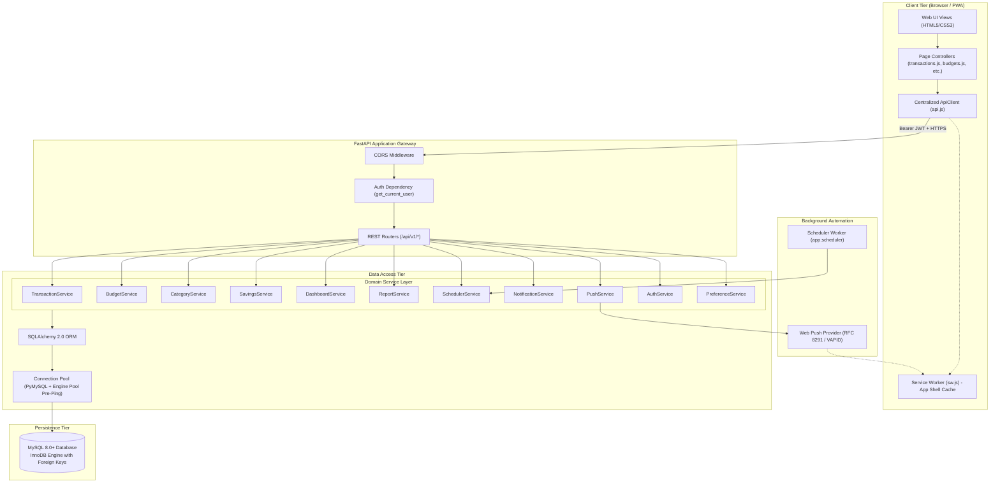
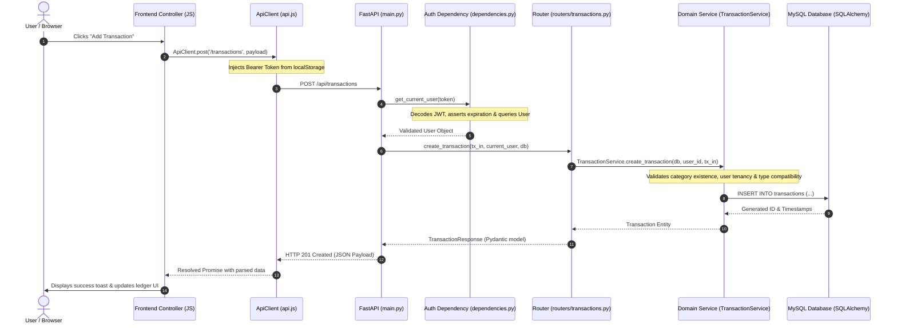

# System Architecture & Design Specification — ExpenseFlow

**Author & Principal Architect**: Chirag Darji ([dchirag516@gmail.com](mailto:dchirag516@gmail.com))  
**Document Version**: 2.0.0  
**Project**: ExpenseFlow — Production-Grade Multi-Tenant Personal Finance & Expense SaaS  

---

## 1. Executive Summary & Architectural Paradigm

ExpenseFlow is built upon a **Layered Clean Architecture** on the backend paired with a **Decoupled Progressive Web Application (PWA) App Shell** on the frontend. 

The system enforces strict **Separation of Concerns (SoC)**, **Multi-Tenant Data Isolation**, and **Idempotent Automation**.

```
+-------------------------------------------------------------------------+
|                          CLIENT APPLICATION                             |
|        Vanilla ES6+ SPA / PWA App Shell + Service Worker (sw.js)       |
+-------------------------------------------------------------------------+
                                    |
                           HTTP/REST (JSON + JWT)
                                    v
+-------------------------------------------------------------------------+
|                       PRESENTATION LAYER (FastAPI)                       |
|           CORS Middleware | JWT Dependencies | Router Controllers       |
+-------------------------------------------------------------------------+
                                    |
                            Calls Domain Logic
                                    v
+-------------------------------------------------------------------------+
|                       DOMAIN / SERVICE LAYER                            |
| TransactionService | BudgetService | CategoryService | SavingsService   |
| AuthService | DashboardService | ReportService | SchedulerService ...   |
+-------------------------------------------------------------------------+
                                    |
                           ORM Entity Operations
                                    v
+-------------------------------------------------------------------------+
|                       DATA ACCESS LAYER (SQLAlchemy)                    |
|             Declarative ORM Models & Scoped Multi-Tenant Queries        |
+-------------------------------------------------------------------------+
                                    |
                               SQL Queries
                                    v
+-------------------------------------------------------------------------+
|                           PERSISTENCE LAYER                             |
|               MySQL 8.0+ Relational Database Engine                     |
+-------------------------------------------------------------------------+
```

### Core Design Paradigms

1. **Layered Clean Architecture**:
   - **Presentation Layer (Routers)**: Thin HTTP controllers responsible only for route definition, query/body parameter parsing, invoking domain services, and returning Pydantic response models.
   - **Business Logic Layer (Services)**: Stateless service classes encapsulating business rules, complex aggregations, tenant authorization assertions, and transactional workflows.
   - **Data Access Layer (Models)**: SQLAlchemy 2.0 Declarative ORM models defining normalized schemas, foreign keys, cascading rules, and composite indexes.
   - **Type Safety & Contract Validation (Schemas)**: Pydantic v2 schemas providing compile-time type validation, input sanitization, decimal precision preservation, and automated OpenAPI documentation.

2. **Decoupled Progressive Web App (PWA) Client**:
   - Modern, vanilla ES6+ architecture free of heavy framework bundle overhead.
   - **App Shell Pattern**: Shared navigation, responsive drawer, notifications flyout, and dynamic user avatar rendered centrally through `auth.js`.
   - **Interception & Resilience**: Centralized `ApiClient` manages JWT authorization headers, automatic redirect on expired sessions, and graceful error normalization.
   - **Privacy-First Offline Shell**: Service Worker (`sw.js`) caches static assets (HTML, CSS, JS, icons) for instant cold startup, while all `/api/*` financial payloads strictly bypass offline caches to guarantee zero client cache leaks.

3. **Multi-Tenant Data Isolation**:
   - Every service operation and database query is strictly parameterized and filtered by `user_id == current_user.id`.
   - Category assignment and foreign key relationships are strictly guarded against cross-tenant hijacking.

---

## 2. System Architecture Diagram



---

## 3. Directory Layout & Module Responsibilities

```
ExpenseFlow/
│
├── .env.example                     # Canonical environment variables template
├── .gitignore                       # Repository exclusion rules (virtualenvs, secrets, cache)
├── ARCHITECTURE.md                  # System architecture specification (this document)
├── LICENSE                          # MIT License (Chirag Darji)
├── README.md                        # Project documentation, feature guides, deployment instructions
│
├── backend/                         # FastAPI Backend Application Root
│   ├── .env.example                 # Backend-specific environment template
│   ├── requirements.txt             # Locked Python dependencies
│   ├── test_qa_suite.py             # Automated end-to-end integration and QA test suite
│   │
│   ├── app/                         # Core Application Package
│   │   ├── __init__.py
│   │   ├── main.py                  # Application entry point, lifespan, CORS, error handlers
│   │   ├── scheduler.py             # Standalone cron/daemon CLI runner for background jobs
│   │   │
│   │   ├── core/                    # Cross-cutting foundational modules
│   │   │   ├── __init__.py
│   │   │   ├── config.py            # Pydantic BaseSettings with multi-path .env resolution
│   │   │   ├── dependencies.py      # Dependency injection (get_current_user, database session)
│   │   │   └── security.py          # Password hashing (bcrypt) and JWT encode/decode
│   │   │
│   │   ├── database/                # Database configuration & session lifecycle
│   │   │   ├── __init__.py
│   │   │   ├── base.py              # DeclarativeBase SQLAlchemy model base
│   │   │   └── connection.py        # Engine pooling, get_db generator, additive schema sync
│   │   │
│   │   ├── models/                  # SQLAlchemy 2.0 ORM Database Entities
│   │   │   ├── __init__.py          # Model exports for Base.metadata discovery
│   │   │   ├── user.py              # User authentication entity
│   │   │   ├── category.py          # Category taxonomy entity
│   │   │   ├── transaction.py       # Financial transactions (Income / Expense)
│   │   │   ├── budget.py            # Monthly category budget limits
│   │   │   ├── savings_goal.py      # Savings goals & progress tracking
│   │   │   ├── reminder.py          # Bill reminders & recurrence rules
│   │   │   ├── recurring_transaction.py # Automated recurring transaction templates
│   │   │   ├── notification.py      # In-app notification records
│   │   │   ├── push_subscription.py # W3C Web Push VAPID subscriptions
│   │   │   └── user_preference.py   # Granular user notification settings
│   │   │
│   │   ├── schemas/                 # Pydantic v2 Request/Response Data Contracts
│   │   │   ├── __init__.py
│   │   │   ├── auth.py              # Token schemas
│   │   │   ├── user.py              # User registration and profile DTOs
│   │   │   ├── category.py          # Category creation, update, and response DTOs
│   │   │   ├── transaction.py       # Transaction DTOs with pagination & aggregates
│   │   │   ├── budget.py            # Budget progress & monthly summary DTOs
│   │   │   ├── savings_goal.py      # Savings goal DTOs with deposit/withdrawal actions
│   │   │   ├── reminder.py          # Reminder DTOs
│   │   │   ├── recurring_transaction.py # Recurring template DTOs
│   │   │   ├── notification.py      # In-app notification DTOs
│   │   │   ├── push_subscription.py # Web push subscription DTOs
│   │   │   ├── dashboard.py         # Dashboard analytics & KPI DTOs
│   │   │   ├── report.py            # Deep reporting and trend DTOs
│   │   │   └── user_preference.py   # User preference toggle DTOs
│   │   │
│   │   ├── services/                # Pure Business Logic / Domain Services
│   │   │   ├── __init__.py          # Service exports
│   │   │   ├── auth_service.py      # Authentication, login verification, token generation
│   │   │   ├── transaction_service.py # Transaction filtering, pagination, aggregates, CRUD
│   │   │   ├── budget_service.py    # Monthly budget aggregation, threshold checks
│   │   │   ├── category_service.py  # Category management, duplicate & deletion safeguards
│   │   │   ├── savings_service.py   # Savings goals, deposits/withdrawals, milestones
│   │   │   ├── dashboard_service.py # Aggregated financial summaries, KPI charts
│   │   │   ├── report_service.py    # Multi-timeframe trend reports & metrics
│   │   │   ├── reminder_service.py  # Bill reminders & calendar-safe roll-forwards
│   │   │   ├── recurring_service.py # Recurring transaction execution & idempotency
│   │   │   ├── notification_service.py # Notification dispatch & unread management
│   │   │   ├── push_service.py      # VAPID payload signing & Web Push delivery
│   │   │   ├── scheduler_service.py # Background automation coordinator
│   │   │   └── preference_service.py # Notification preferences domain logic
│   │   │
│   │   └── routers/                 # Thin REST API Endpoint Controllers
│   │       ├── __init__.py
│   │       ├── auth.py              # /api/auth
│   │       ├── categories.py        # /api/categories
│   │       ├── transactions.py      # /api/transactions
│   │       ├── budgets.py           # /api/budgets
│   │       ├── savings.py           # /api/goals
│   │       ├── dashboard.py         # /api/dashboard
│   │       ├── reports.py           # /api/reports
│   │       ├── reminders.py         # /api/reminders
│   │       ├── recurring.py         # /api/recurring
│   │       ├── notifications.py     # /api/notifications
│   │       ├── push.py              # /api/push
│   │       ├── preferences.py       # /api/preferences
│   │       └── scheduler.py         # /api/scheduler
│   │
│   └── database/                    # SQL migration scripts & seeders
│       ├── schema.sql               # Pure SQL DDL schema definition
│       └── seed.py                  # Demo data populator with production safeguard
│
├── frontend/                        # Decoupled Static Single-Page Application (PWA)
│   ├── index.html                   # Landing page / redirection gate
│   ├── offline.html                 # Offline fallback view for Service Worker
│   ├── manifest.webmanifest         # PWA installation metadata
│   ├── sw.js                        # Service Worker caching & push handler
│   ├── _redirects                   # Netlify/SPA route redirect rules
│   │
│   ├── css/                         # Design System & Responsive Stylesheets
│   │   ├── style.css                # Global design system tokens, typography, badges, modals
│   │   ├── auth.css                 # Login / register card layouts
│   │   ├── dashboard.css            # Charts, KPI cards, tables, and widgets
│   │   └── responsive.css           # Mobile sidebar drawer, bottom navigation, breakpoints
│   │
│   ├── js/                          # Frontend Controllers & Utility Modules
│   │   ├── api.js                   # Centralized API fetch client with JWT interceptors
│   │   ├── auth.js                  # App shell renderer, session state, navigation
│   │   ├── toast.js                 # Floating toast notification system
│   │   ├── utils.js                 # Currency formatters, date helpers, debounce, theme
│   │   ├── dashboard.js             # Dashboard controller & Chart.js instances
│   │   ├── transactions.js          # Transaction manager controller (filters, pagination)
│   │   ├── budgets.js               # Budget controller & progress indicators
│   │   ├── categories.js            # Category taxonomy manager
│   │   ├── goals.js                 # Savings goals controller & deposit modal
│   │   ├── reminders.js             # Bill reminders controller
│   │   ├── recurring.js             # Recurring transactions template manager
│   │   ├── reports.js               # Financial analytics & Chart.js reports
│   │   └── notifications.js         # Header flyout & Web Push registration
│   │
│   ├── pages/                       # Application Views (HTML5)
│   │   ├── login.html               # User authentication view
│   │   ├── register.html            # User account registration view
│   │   ├── dashboard.html           # Main dashboard view
│   │   ├── transactions.html        # Transactions ledger view
│   │   ├── budgets.html             # Monthly budgets view
│   │   ├── categories.html          # Category settings view
│   │   ├── goals.html               # Savings goals view
│   │   ├── reminders.html           # Reminders view
│   │   ├── recurring.html           # Recurring templates view
│   │   ├── reports.html             # Analytics reports view
│   │   ├── profile.html             # User profile view
│   │   └── settings.html            # App & notification settings view
│   │
│   └── icons/                       # High-resolution PWA icons (192px, 512px, badge)
│
└── tests/                           # System-Level Audit & Verification
    └── audit_suite.py               # Remote HTTP and mathematical reconciliation audit suite
```

---

## 4. End-to-End Data Flow & Request Lifecycle



---

## 5. State Management & Client-Server Synchronization

The frontend adopts a lightweight, predictable state management approach:
1. **Single Source of Truth**: The relational database remains the authoritative single source of truth.
2. **Session Persistence**: JWT token and user profile are persisted in `localStorage`.
3. **Decoupled Page State**: Each controller (`transactions.js`, `budgets.js`, etc.) manages its local query state (pagination, active filters, search keywords) in module-scoped variables.
4. **Reactive Events**: Custom DOM events (e.g. `themechange`) notify independent widgets when global user settings change, triggering chart color re-rendering without page reloads.
5. **Optimistic Updates with Reversion**: Actions like marking a reminder completed or updating a budget update the UI optimistically while firing the asynchronous API call, reverting and alerting via `toast.js` if the network request fails.

---

## 6. Type Safety & Validation Contracts

All API transactions are governed by strict Pydantic v2 schemas:
- **Strict Decimal Precision**: Monetary quantities (`amount`, `target_amount`, `current_amount`) use Python's `Decimal` type to eliminate IEEE-754 floating-point inaccuracies.
- **Range & String Constraints**: Pydantic `Field(..., gt=0, decimal_places=2)` enforces positive amounts; string inputs are trimmed and bounded with `min_length` and `max_length`.
- **Enum Concurrency**: Status fields (`TransactionType`, `CategoryType`, `GoalStatus`, `FrequencyType`, `ReminderStatus`) use Python `Enum` values mapped directly to database column enums.
- **Centralized Validation Messages**: Custom exception handlers in `main.py` intercept Pydantic validation failures and format them into readable, field-specific error summaries for immediate UI display.

---

## 7. Security Architecture

1. **Cryptographic Password Hashing**: Passwords undergo salted `bcrypt` hashing with a minimum work-factor cost of 12. Plaintext credentials are never retained in memory or persisted.
2. **Zero Credential Leakage**: Database models and API serialization schemas explicitly omit password hashes (`password_hash`) from any response payload.
3. **Strict Multi-Tenant Scoping**: All queries are bound to the authenticated `user_id`. No endpoint permits referencing or mutating foreign entities across tenants.
4. **Cross-Origin Resource Sharing (CORS)**: Strict origin whitelisting via environment configuration blocks unauthorized third-party domains.
5. **Web Push Privacy & VAPID**: Web push subscriptions utilize standard VAPID key pairs; push notifications convey only high-level alerts without embedding raw financial account balances.

---

## 8. Author & Maintainer

- **Architect & Lead Developer**: Chirag Darji
- **Email**: [dchirag516@gmail.com](mailto:dchirag516@gmail.com)
- **Role**: Principal Software Architect
